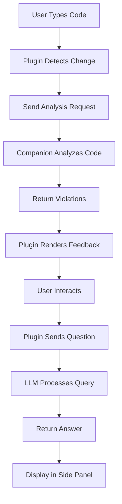

# CodeMentor AI Architecture

## Overview

CodeMentor AI is built as a two-component system designed to provide intelligent coding convention feedback directly within the Cursor IDE.

## Architecture Components

### 1. Cursor IDE Plugin (`packages/cursor-plugin`)
- **Technology**: TypeScript, VS Code Extension API
- **Responsibilities**:
  - Real-time code monitoring and document change detection
  - Visual feedback (highlighting, decorations)
  - Hover tooltip providers
  - Interactive side panel (webview) management
  - Communication with companion service via HTTP/WebSocket

### 2. Desktop Companion Service (`packages/companion-app`)
- **Technology**: Python, FastAPI
- **Responsibilities**:
  - Code analysis and AST parsing
  - Convention rule engine
  - AI/LLM integration for Q&A functionality
  - RESTful API for plugin communication
  - Background processing and caching

### 3. Shared Contracts (`packages/shared`)
- **Technology**: TypeScript
- **Responsibilities**:
  - Type definitions shared between components
  - API contract specifications
  - Communication protocol schemas

## Communication Flow

```
┌─────────────────┐    HTTP/WebSocket    ┌──────────────────────┐
│                 │ ───────────────────► │                      │
│  Cursor Plugin  │                      │  Companion Service   │
│                 │ ◄─────────────────── │                      │
└─────────────────┘    JSON Messages     └──────────────────────┘
```

### Message Flow
1. **Code Change Detection**: Plugin monitors active document changes
2. **Analysis Request**: Plugin sends code snippet to companion service
3. **Convention Analysis**: Service analyzes code using rule engine
4. **Response**: Service returns violations, suggestions, and metadata
5. **Visual Feedback**: Plugin renders highlights and tooltips
6. **Interactive Learning**: User interactions trigger additional API calls

## Data Flow



## Directory Structure

```
codementor-ai/
├── packages/
│   ├── cursor-plugin/              # VS Code extension
│   │   ├── src/
│   │   │   ├── extension.ts        # Main extension entry
│   │   │   ├── providers/          # Hover, decoration providers
│   │   │   ├── panels/             # Side panel webview logic
│   │   │   └── communication/      # Service communication
│   │   └── package.json
│   │
│   ├── companion-app/              # Python FastAPI service
│   │   ├── src/
│   │   │   ├── main.py             # FastAPI application
│   │   │   ├── analysis/           # Code analysis engine
│   │   │   ├── conventions/        # Rule definitions
│   │   │   └── llm/                # AI integration
│   │   └── requirements.txt
│   │
│   └── shared/                     # Shared contracts
│       ├── src/
│       │   └── index.ts            # Type definitions
│       └── package.json
│
├── tools/                          # Build and development tools
├── docs/                           # Documentation
├── tests/                          # Integration tests
└── scripts/                        # Development automation
```

## Development Workflow

1. **Setup**: Run `./scripts/setup.sh` to initialize environment
2. **Development**: Run `./scripts/dev-start.sh` for live development
3. **Building**: Run `./scripts/build-all.sh` for production builds
4. **Testing**: Run plugin tests via F5 in VS Code, service tests via pytest

## Deployment Strategy

- **Plugin**: Packaged as `.vsix` file for VS Code marketplace
- **Companion Service**: Standalone executable or Python package
- **Distribution**: Combined installer that sets up both components

## Key Design Decisions

### Monorepo Structure
- **Benefits**: Shared types, unified tooling, atomic commits
- **Tradeoffs**: More complex initial setup vs. better long-term maintainability

### Two-Component Architecture
- **Benefits**: Separation of concerns, language optimization, scalability
- **Tradeoffs**: Network communication overhead vs. processing power

### Local-First Design
- **Benefits**: Privacy, performance, offline capability
- **Tradeoffs**: Resource usage vs. cloud-based processing 